# envctl Architecture

This document provides an overview of the envctl architecture, including its major components, data flows, and design patterns.

## Overview

envctl is a CLI tool for managing environment variables with peer-to-peer synchronization and post-quantum cryptography. It enables teams to share secrets securely without relying on centralized servers.

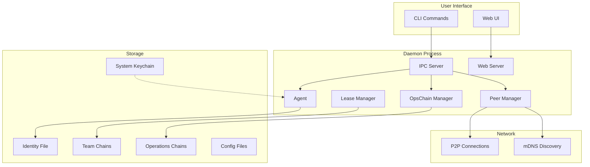

## Core Components

### CLI (`internal/cli/`)

The command-line interface is built with [Cobra](https://github.com/spf13/cobra) and provides these command groups:

| Command | Description |
|---------|-------------|
| `envctl init` | Initialize identity and configuration |
| `envctl daemon` | Daemon management (start/stop/status) |
| `envctl identity` | Identity management |
| `envctl team` | Team membership and invitations |
| `envctl peers` | Peer discovery and management |
| `envctl env` | Environment variable operations |

### Daemon (`internal/daemon/`)

The daemon is the central background service that handles all P2P networking, cryptographic operations, and state management.

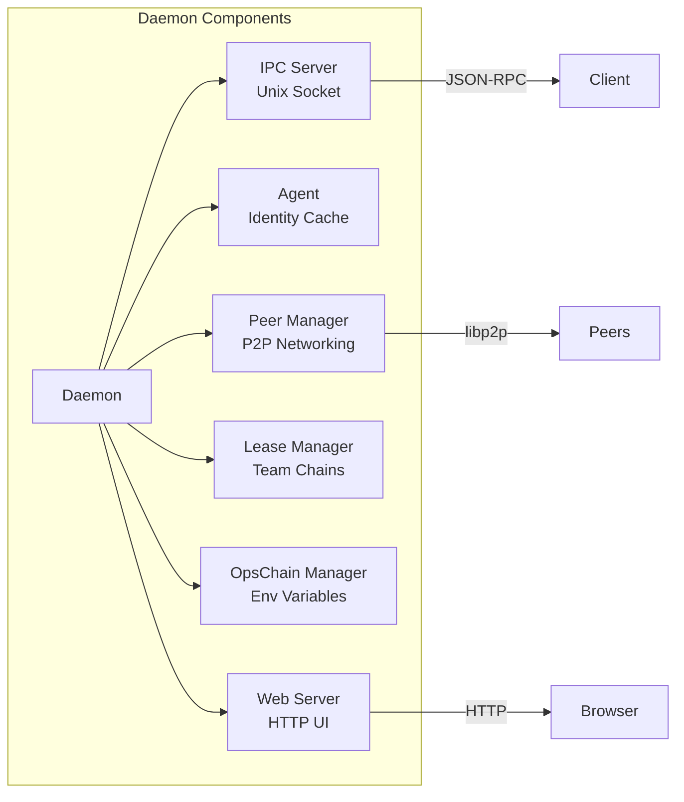

#### Key Daemon Files

- **`daemon.go`** - Main daemon struct and lifecycle
- **`ipc.go`** - IPC request handlers
- **`agent.go`** - Identity caching with auto-expiry
- **`peers.go`** - Peer discovery and connection management
- **`leases.go`** - Team chain management
- **`opschain.go`** - Operations chain management
- **`web.go`** - Web UI server

### Agent (`internal/daemon/agent.go`)

The Agent holds the unlocked identity in memory, enabling cryptographic operations without repeated passphrase prompts.

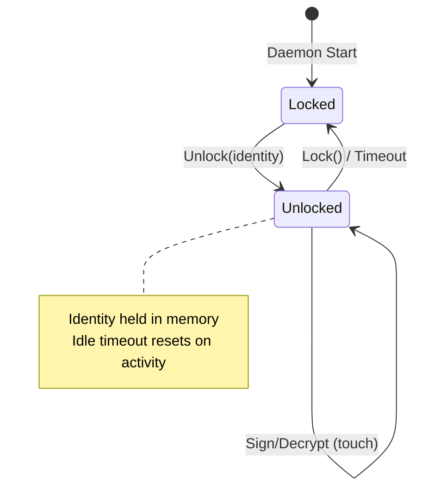

The agent:
- Caches the decrypted identity after passphrase entry
- Supports configurable timeout and idle timeout
- Provides Sign() and Decrypt() operations
- Auto-locks on timeout or system sleep

### Client (`internal/client/`)

The client package provides IPC communication with the daemon via Unix sockets.

```go
// Connect to daemon
c, err := client.Connect()
defer c.Close()

// Make requests
status, err := c.Status()
peers, err := c.ListPeers()
```

## Cryptography (`internal/crypto/`)

envctl uses post-quantum cryptography to protect against future quantum computer attacks.

### Algorithms

| Purpose | Algorithm | Standard |
|---------|-----------|----------|
| Key Encapsulation | ML-KEM-768 | FIPS 203 |
| Digital Signatures | ML-DSA-65 | FIPS 204 |
| Symmetric Encryption | ChaCha20-Poly1305 | RFC 8439 |
| Key Derivation | Argon2id | RFC 9106 |

### Identity Structure

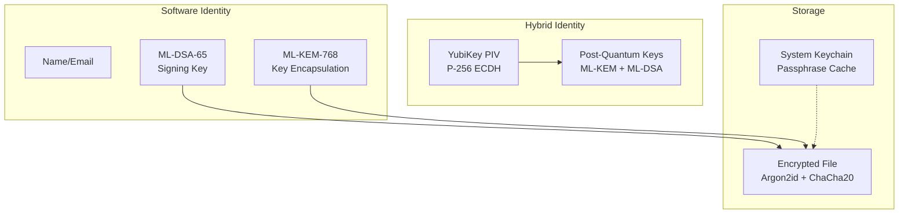

### Encryption Flow

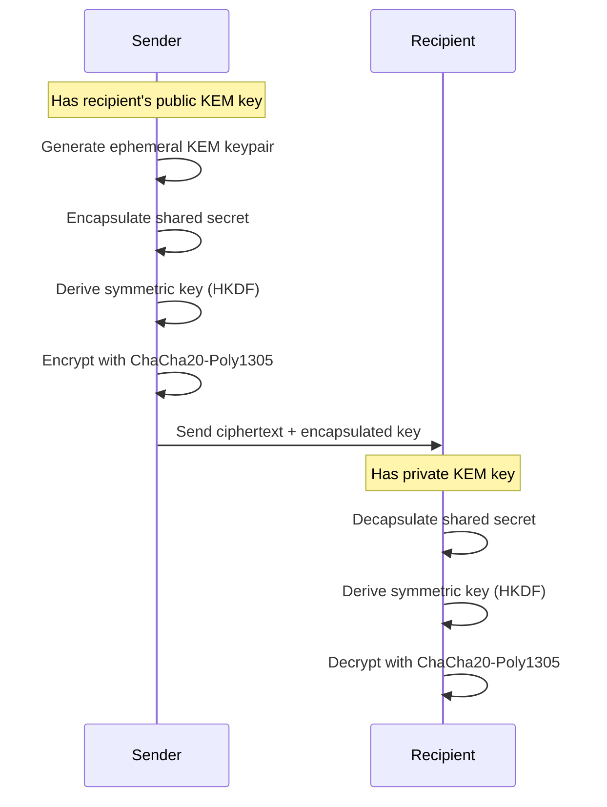

## P2P Networking (`internal/p2p/`)

Built on [libp2p](https://libp2p.io/), the P2P layer handles peer discovery and secure communication.

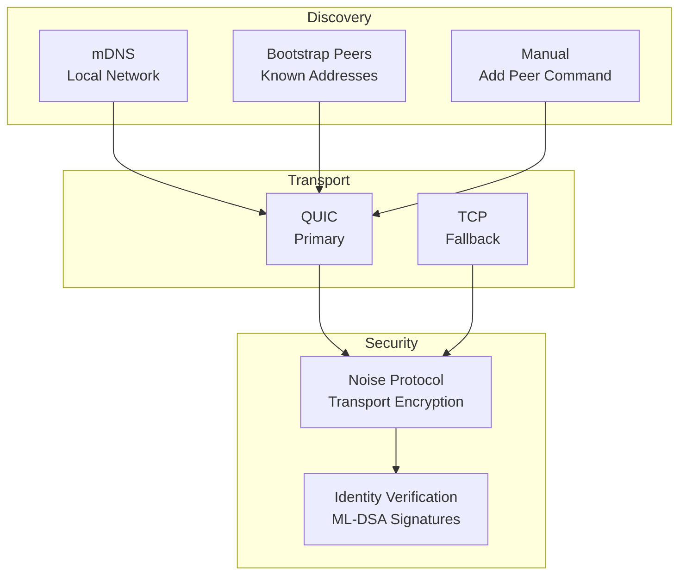

### Protocol Messages

The P2P protocol uses protobuf-encoded messages:

| Message | Direction | Purpose |
|---------|-----------|---------|
| `Handshake` | Bidirectional | Exchange identity info |
| `ChainSync` | Request/Response | Synchronize team chains |
| `OpsPush` | Push | Send operation chain updates |
| `PeerAnnounce` | Broadcast | Announce new peers |

## Blockchain System (`internal/chain/`)

envctl uses append-only blockchains for team membership and operations.

### Team Chain

Each team has a chain that records membership changes:

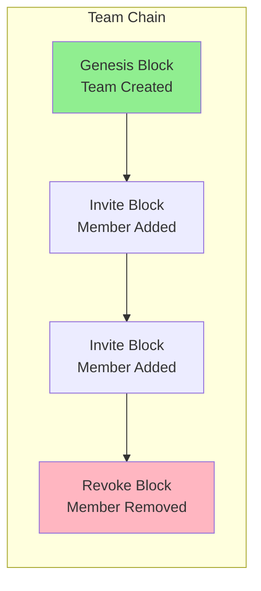

Each block contains:
- Previous block hash
- Timestamp
- Operation type (invite/revoke)
- Member public key
- Signature from authorized member

### Operations Chain

Environment variable changes are tracked in per-project operation chains:

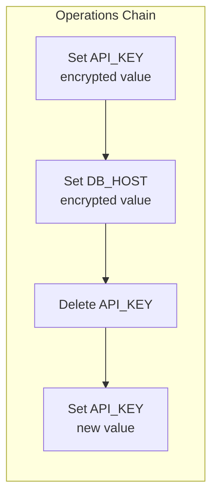

Operations are:
- Cryptographically signed by the author
- Encrypted to all team members
- Synchronized across peers
- Deterministically ordered

## Environment Variables (`internal/ops/`)

Environment variables are managed through an operations-based model:

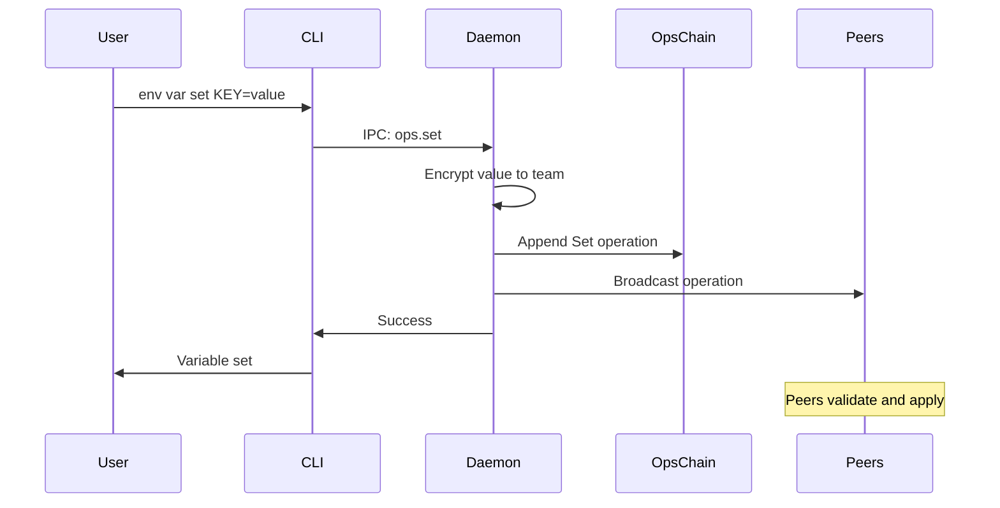

### Variable Resolution

When reading variables, the operations chain is replayed:

1. Start with empty state
2. Apply each operation in order
3. Set operations add/update values
4. Delete operations remove values
5. Final state is current values

## Configuration (`internal/config/`)

Configuration is stored in the envctl home directory:

```
~/.envctl/
├── config.yaml          # User configuration
├── identity.enc         # Encrypted identity
├── daemon.pid           # Daemon PID file
├── daemon.sock          # IPC socket
├── chains/              # Team membership chains
│   └── <team-id>/
│       └── chain.json
└── ops/                 # Operations chains
    └── <project-id>/
        └── ops.json
```

### Config File Format

```yaml
# ~/.envctl/config.yaml
daemon:
  p2p_port: 7834
  web_port: 7835
  web_enabled: true

agent:
  timeout: 1h
  idle_timeout: 30m

peers:
  bootstrap:
    - /ip4/192.168.1.100/tcp/7834/p2p/QmXxx...
```

## IPC Protocol

CLI commands communicate with the daemon via JSON-RPC over Unix sockets.

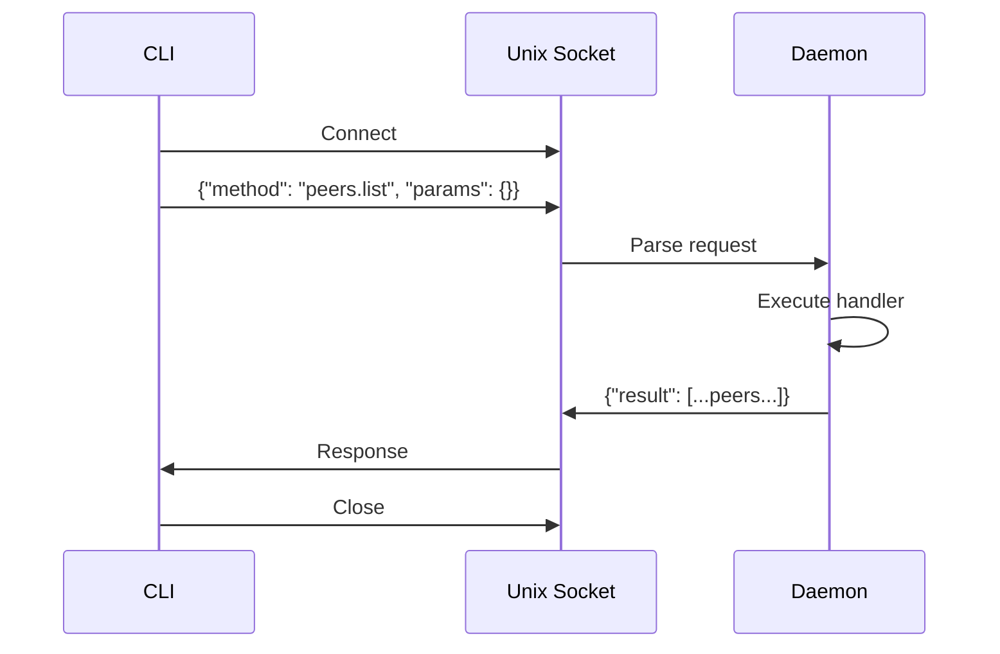

### Available Methods

| Method | Description |
|--------|-------------|
| `status` | Get daemon status |
| `peers.list` | List connected peers |
| `peers.add` | Add peer by address |
| `team.list` | List teams |
| `team.create` | Create new team |
| `team.invite` | Invite member |
| `ops.set` | Set variable |
| `ops.get` | Get variable |
| `ops.list` | List variables |

## Security Model

### Threat Model

envctl protects against:
- **Passive network observers** - All P2P traffic is encrypted
- **Future quantum computers** - Post-quantum algorithms
- **Compromised peers** - Cryptographic verification of all operations
- **Stolen identity files** - Passphrase-based encryption

### Key Security Properties

1. **End-to-end encryption** - Variables encrypted to specific recipients
2. **Forward secrecy** - Ephemeral keys for each encryption
3. **Non-repudiation** - All operations are signed
4. **Integrity** - Blockchain prevents tampering
5. **Access control** - Team chain enforces membership

### Passphrase Flow

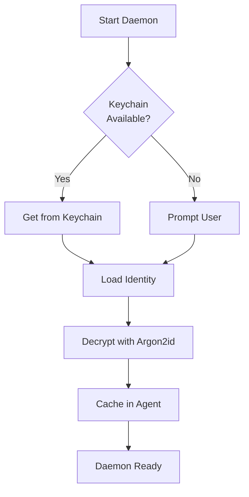

## Build and Development

### Project Structure

```
envctl/
├── cmd/envctl/          # Main entry point
├── internal/
│   ├── cli/             # Command implementations
│   ├── client/          # IPC client
│   ├── config/          # Configuration management
│   ├── crypto/          # Cryptographic operations
│   ├── daemon/          # Background daemon
│   ├── keychain/        # System keychain integration
│   ├── chain/           # Blockchain implementation
│   ├── ops/             # Operations chain
│   ├── p2p/             # Peer-to-peer networking
│   ├── tui/             # Terminal UI helpers
│   └── yubikey/         # YubiKey integration
├── docs/                # Documentation
└── test/                # Integration tests
```

### Dependencies

Key external dependencies:

- `github.com/spf13/cobra` - CLI framework
- `github.com/libp2p/go-libp2p` - P2P networking
- `github.com/cloudflare/circl` - Post-quantum crypto
- `github.com/zalando/go-keyring` - System keychain
- `github.com/go-piv/piv-go` - YubiKey PIV
