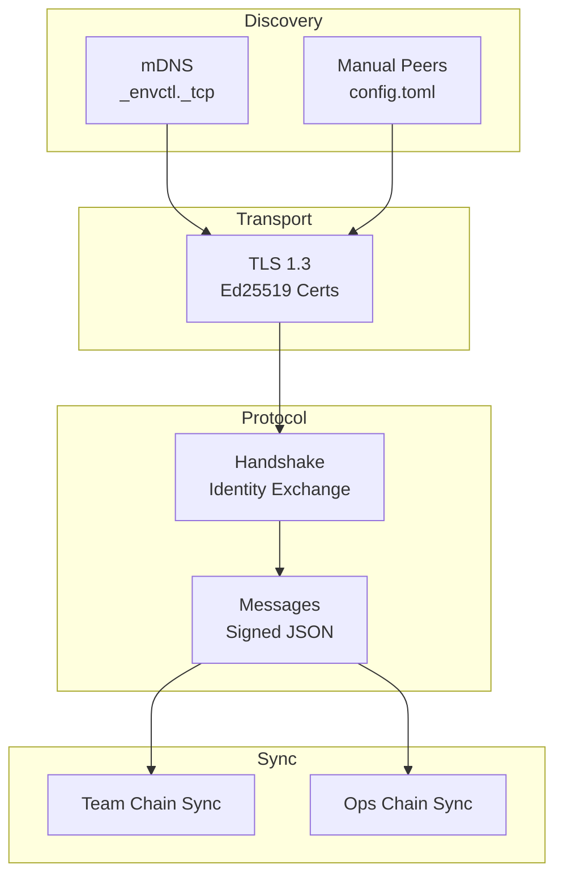
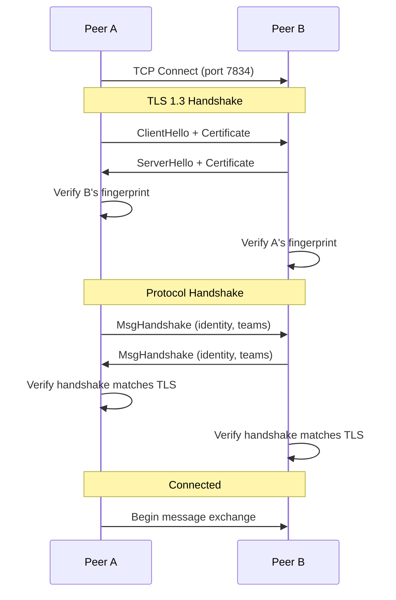
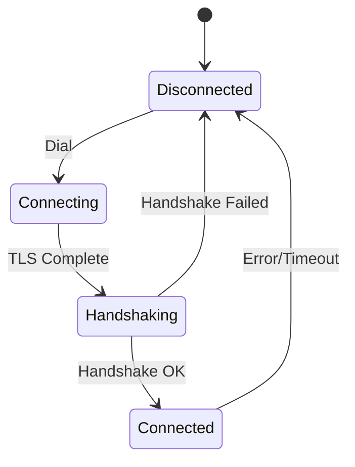
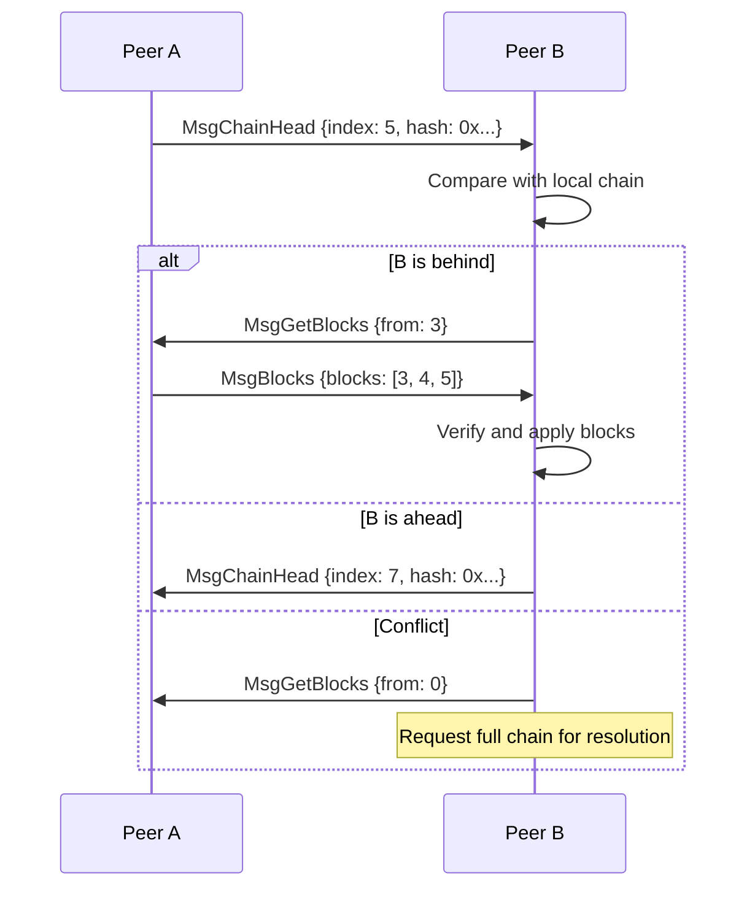
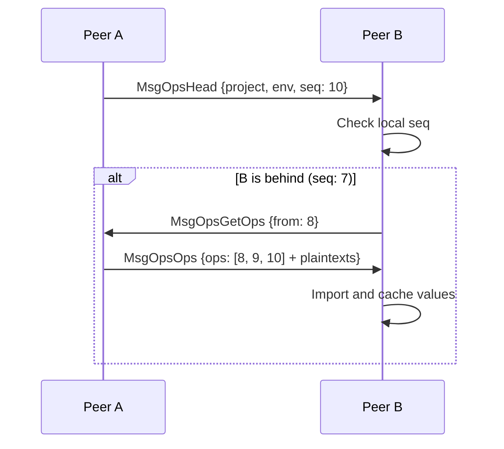
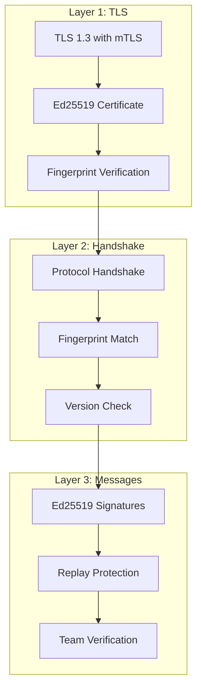

# envctl P2P Protocol

This document describes the peer-to-peer networking protocol used by envctl for distributed synchronization.

## Overview

envctl uses a custom P2P protocol built on TLS 1.3 with Ed25519 certificates. Peers discover each other via mDNS on local networks and synchronize team chains and environment variables directly without central servers.



## Peer Discovery

### mDNS Discovery

envctl uses multicast DNS to discover peers on the local network:

| Property | Value |
|----------|-------|
| Service Type | `_envctl._tcp` |
| Domain | `local.` |
| Browse Interval | 30 seconds |
| Protocols | IPv4 and IPv6 |

**Advertised TXT Records:**

```
fp=<fingerprint>     # SHA-256 of Ed25519 public key (first 16 hex chars)
name=<identity>      # Identity display name
teams=<team1,team2>  # Comma-separated team list
v=1                  # Protocol version
```

### Manual Peers

Peers can be configured manually in `config.toml`:

```toml
[discovery]
mdns = true
manual_peers = [
    "192.168.1.100:7834",
    "peer.example.com:7834"
]
```

Or added at runtime:

```bash
envctl peers add 192.168.1.100:7834
```

## Connection Establishment

### Connection Flow



### TLS Configuration

| Setting | Value |
|---------|-------|
| Minimum Version | TLS 1.3 |
| Certificate Type | Self-signed Ed25519 |
| Certificate Validity | 100 years |
| Client Auth | Required (mutual TLS) |
| Verification | Fingerprint-based |

**Fingerprint Calculation:**
```go
fingerprint = hex(sha256(ed25519_public_key)[:8])
```

### Protocol Handshake

After TLS, peers exchange handshake messages:

```go
type Handshake struct {
    Version    string      // "1.0.0"
    MinVersion string      // Minimum compatible version
    Pubkey     []byte      // Ed25519 signing key
    MLKEMPub   []byte      // ML-KEM post-quantum key
    Name       string      // Identity name
    Teams      []string    // Team memberships
    Addresses  []PeerAddr  // Alternative addresses
}
```

**Verification Steps:**
1. Version compatibility check
2. Required fields present (pubkey, name)
3. Handshake fingerprint matches TLS certificate

### Peer States



## Message Protocol

### Message Format

Messages are JSON over length-prefixed binary framing:

```
┌──────────────┬─────────────────────────────┐
│ Length (4B)  │ JSON Payload                │
│ Big-endian   │ (up to 10 MB)               │
└──────────────┴─────────────────────────────┘
```

### Message Structure

```go
type Message struct {
    Type      MessageType     // Message type identifier
    Timestamp time.Time       // UTC timestamp
    Payload   json.RawMessage // Type-specific data
    From      []byte          // Sender's public key
    Nonce     uint64          // Monotonic counter
    Signature []byte          // Ed25519 signature
}
```

**Signature Calculation:**
```
signature = ed25519_sign(Type || Timestamp || Nonce || Payload)
```

### Message Types

**Control Messages:**

| Type | Purpose |
|------|---------|
| `MsgPing` | Keep-alive (30s interval) |
| `MsgPong` | Ping response |
| `MsgHandshake` | Identity exchange |
| `MsgAck` | Generic acknowledgement |
| `MsgReject` | Request rejection |

**Team Chain Sync:**

| Type | Purpose |
|------|---------|
| `MsgChainHead` | Announce chain head (index + hash) |
| `MsgGetBlocks` | Request blocks from index |
| `MsgBlocks` | Block response (up to 100) |
| `MsgProposal` | New block proposal |
| `MsgApproval` | Block approval signature |

**Ops Chain Sync:**

| Type | Purpose |
|------|---------|
| `MsgOpsHead` | Announce ops head (project + env + seq) |
| `MsgOpsGetOps` | Request operations from seq |
| `MsgOpsOps` | Operations response |
| `MsgOpsPush` | Push new operations |
| `MsgOpsAck` | Acknowledge receipt |

**Environment Sharing:**

| Type | Purpose |
|------|---------|
| `MsgRequest` | Request environment variables |
| `MsgOffer` | Offer to share variables |
| `MsgPayload` | Encrypted environment data |
| `MsgEnvUpdated` | Notify of stale data |

**Join Flow:**

| Type | Purpose |
|------|---------|
| `MsgChainRequest` | Request chain by invite code |
| `MsgChainResponse` | Full chain for new joiner |
| `MsgJoinRequest` | New member join request |
| `MsgJoinApproved` | Approval with member-add block |

### Rejection Codes

| Code | Meaning |
|------|---------|
| `not_member` | Not a team member |
| `no_access` | Access denied |
| `version_mismatch` | Protocol incompatible |
| `invalid_request` | Malformed request |
| `rate_limited` | Rate limit exceeded |

## Chain Synchronization

### Team Chain Sync

Team chains are synchronized every 60 seconds:



### Ops Chain Sync

Operations chains sync every 30 seconds:



### Operations Wire Format

```go
type OpsOperation struct {
    Seq            uint64  // Sequence number
    Timestamp      int64   // Unix nanoseconds
    Author         []byte  // Public key
    Op             string  // "set" or "delete"
    Key            string  // Variable name
    EncryptedValue []byte  // Original encrypted (for verification)
    Value          string  // Plaintext (for caching)
    PrevHash       []byte  // Previous op hash
    Signature      []byte  // Ed25519 signature
}
```

The plaintext `Value` is sent over the encrypted TLS channel to allow recipients to cache values they can't decrypt.

## Security

### Multi-Layer Authentication



### Replay Protection

Each message includes a monotonically increasing nonce:

```go
type PeerState struct {
    lastSeenNonce uint64  // Reject if new nonce <= this
}

func (p *Peer) ValidateNonce(msg *Message) bool {
    if msg.Nonce <= p.lastSeenNonce {
        return false  // Replay detected
    }
    p.lastSeenNonce = msg.Nonce
    return true
}
```

### Team-Based Access

Messages are only processed if sender is a team member:

```go
func (p *PeerManager) handleChainSync(peer *Peer, msg *Message) {
    // Verify peer is member of the team
    if !p.isTeamMember(msg.TeamID, peer.Pubkey) {
        p.sendReject(peer, "not_member")
        return
    }
    // Process sync...
}
```

## Rate Limiting

### Connection Limits

Applied before parsing (DoS protection):

| Limit | Value |
|-------|-------|
| Max total connections | 100 |
| New connections/second | 10 |
| Burst | 20 |
| Per-IP connections | 5 |
| Per-IP rate | 2/second |
| Handshake timeout | 10 seconds |

**Failure Tracking:**
- 5 failures within 1 minute → 5-minute IP ban

### Message Limits

Applied after authentication:

| Limit | Value |
|-------|-------|
| Global message rate | 500/sec (burst 1000) |
| Per-peer rate | 50/sec (burst 100) |

**Per-Message-Type Limits (per minute):**

| Message Type | Limit |
|--------------|-------|
| Ping/Pong | 120 |
| Chain sync | 20-30 |
| Proposals/Approvals | 10-20 |
| Handshake | 5 |

**Size Limits:**

| Message Type | Max Size |
|--------------|----------|
| Blocks | 5 MB |
| Payloads | 5 MB |
| Most others | 1-4 KB |

### Disconnection Policy

Peers are disconnected after 100+ rate limit drops.

## Network Architecture

### No Central Server

envctl operates without any central infrastructure:

- **Discovery**: mDNS on local network + manual peer list
- **Sync**: Direct peer-to-peer connections
- **Security**: Cryptographic verification (no trusted server)

### Current Limitations

| Feature | Status |
|---------|--------|
| NAT Traversal | Not implemented |
| Relay/TURN | Not implemented |
| UPnP | Not implemented |
| DHT Discovery | Not implemented |

Peers must be able to establish direct TCP connections.

### Design Philosophy

> "Security is enforced at the crypto layer (signatures, encryption, team membership) not at the network layer"

This means:
- Any peer can discover others via mDNS
- Join flow works before team membership
- Future relay support possible without security changes

## Peer Management

### Persistence

Peers are saved to disk for reconnection:

```json
// ~/.config/envctl/peers.json
{
  "peers": [
    {
      "fingerprint": "a1b2c3d4e5f6g7h8",
      "name": "alice-laptop",
      "addresses": ["192.168.1.100:7834"],
      "last_seen": "2024-12-30T12:00:00Z",
      "teams": ["myproject"]
    }
  ]
}
```

### Connection Lifecycle

```go
// Per-peer goroutines
go peer.sendLoop()    // Buffered channel (100 messages)
go peer.receiveLoop() // With rate limiting
go peer.pingLoop()    // 30-second keep-alive
```

### Event Broadcasting

IPC clients are notified of peer events:

```go
type PeerEvent struct {
    Type        string  // "connected", "disconnected", "rejected"
    Fingerprint string
    Name        string
    Reason      string  // For rejections
}
```

## Ports and Defaults

| Port | Purpose |
|------|---------|
| 7834 | P2P connections (TCP) |
| 7835 | Web UI (HTTP) |

Both configurable in `config.toml`:

```toml
[daemon]
p2p_port = 7834
web_port = 7835
```
