# envctl Security Model

This document describes the security architecture, cryptographic design, threat model, and security properties of envctl.

## Overview

envctl is designed with a zero-infrastructure security model where all cryptographic operations happen locally or peer-to-peer, eliminating central points of compromise. The system uses post-quantum cryptography to protect against future quantum computer attacks while maintaining strong classical security guarantees.


## Cryptographic Algorithms

### Algorithm Summary

| Purpose | Algorithm | Security Level | Standard |
|---------|-----------|----------------|----------|
| Key Encapsulation | ML-KEM-768 | 192-bit PQ | FIPS 203 |
| Digital Signatures | Ed25519 | 128-bit | RFC 8032 |
| PQ Signatures | ML-DSA-65 | 192-bit PQ | FIPS 204 |
| Symmetric Encryption | AES-256-GCM | 256-bit | NIST SP 800-38D |
| Key Derivation (password) | Argon2id | - | RFC 9106 |
| Key Derivation (keys) | HKDF-SHA256 | 256-bit | RFC 5869 |
| Hybrid Key Exchange | P-256 ECDH | 128-bit | FIPS 186-4 |

### Post-Quantum Cryptography

envctl uses NIST-standardized post-quantum algorithms to protect against future quantum computer attacks:

**ML-KEM-768 (Key Encapsulation)**
- Used for all asymmetric encryption of secrets
- Provides IND-CCA2 security against quantum adversaries
- 1088-byte ciphertext overhead
- Protects long-term confidentiality of stored secrets

**ML-DSA-65 (Digital Signatures)**
- Available for post-quantum signature operations
- Used in hybrid identity mode with YubiKey
- 3309-byte signatures, 1952-byte public keys
- Provides non-repudiation against quantum adversaries

### Encryption Flow


### Signature Verification

All chain operations require Ed25519 signatures:


## Identity Protection

### Software Identity

Software identities are protected with strong password-based encryption:


**Argon2id Parameters:**
- Memory: 128 MiB (exceeds OWASP minimum of 19 MiB)
- Iterations: 4 (exceeds OWASP minimum of 2)
- Parallelism: 4 threads
- Output: 32 bytes (256 bits)
- Salt: 16 bytes random per identity

### Hardware-Backed Identity (YubiKey)

For maximum security, identities can be stored on YubiKey:


**Security Properties:**
- P-256 private keys never leave YubiKey hardware
- Touch required for each cryptographic operation
- PIN protection (6-8 digits)
- PQC keys encrypted with YubiKey-derived secret
- Hybrid signatures require both YubiKey + PQC verification

### Keychain Integration

The system keychain can store the passphrase for convenience:

| Platform | Backend |
|----------|---------|
| macOS | Keychain Services |
| Linux | Secret Service API (GNOME Keyring, KWallet) |
| Windows | Credential Manager |

The daemon attempts keychain retrieval before prompting for passphrase.

### Memory Protection

Sensitive data receives special handling:

```go
// Protected buffer with mlock
type ProtectedBuffer struct {
    data   []byte
    locked bool  // mlock succeeded
}

// Constant-time zeroing
func ZeroBytes(b []byte) {
    subtle.ConstantTimeCopy(1, b, make([]byte, len(b)))
    runtime.KeepAlive(b)
}
```

- `mlock()` prevents swapping to disk (when available)
- Constant-time zeroing prevents compiler optimization
- Finalizers ensure cleanup on garbage collection

## Access Control

### Team Membership Chain

Access control is enforced through an append-only blockchain:


Each block contains:
- Previous block hash (SHA-256)
- Timestamp
- Operation type and payload
- Proposer signature (Ed25519)
- Required approval signatures

### Role-Based Permissions

| Role | Manage Members | Manage Environments | Write Secrets | Read Secrets |
|------|----------------|---------------------|---------------|--------------|
| Admin | Yes | Yes | Yes | Yes |
| Member | No | No | Yes | Yes |
| Reader | No | No | No | Yes |

### Approval Requirements

Changes to team membership require cryptographic approval:

```mermaid
graph TB
    Propose[Propose Change] --> Check{Team Size}
    Check -->|Solo + Flag| Accept[0 Approvals]
    Check -->|2-3 Members| Min1[Min 1 Approval]
    Check -->|Larger| Calc[Calculate Required]

    Calc --> Formula["max(minApprovals,<br/>ceil(size × threshold))"]
    Formula --> Cap["Cap at size - 1<br/>(proposer excluded)"]
```



**Approval Rules:**
- Proposer cannot approve their own proposal
- Each approval is an Ed25519 signature
- Approvals verified against current member list
- Requests expire per policy (default: 7 days)

### Invite System

Invites bind a code to a specific public key:


**Invite Properties:**
- 9-character alphanumeric (excludes 0/O/1/I/L)
- Bound to recipient's public key hash
- Single use, expires after configured time
- Revocable by admin before use

## Network Security

### Transport Encryption

All peer-to-peer connections use TLS 1.3 with mutual authentication:


**TLS Configuration:**
- Minimum version: TLS 1.3
- Mutual authentication required
- Self-signed certificates from Ed25519 keys
- Fingerprint verification (SHA-256 of public key)

### Peer Verification

Peers are verified by comparing fingerprints:

```go
// Fingerprint: first 8 bytes of SHA256(public_key)
func Fingerprint(pubkey []byte) string {
    hash := sha256.Sum256(pubkey)
    return hex.EncodeToString(hash[:8])
}
```

**Verification Options:**

1. **Automatic**: Fingerprint in TLS certificate matches known peer
2. **Manual SAS**: Out-of-band verification using Short Authentication Strings

### Short Authentication Strings (SAS)

For high-security scenarios, users can verify peer identity out-of-band:

```
SAS: 🔑 🎯 🚀 🎨  alpha bravo charlie delta
```

Both parties compute the same SAS from their combined public keys. Verbal confirmation detects man-in-the-middle attacks.

## Secret Encryption

### Environment Variable Storage

Environment variables are encrypted to specific recipients:


### Secret Sharing Flow


### Forward Secrecy

Each encryption uses ephemeral keys:

- ML-KEM: Fresh encapsulation per message
- YubiKey ECDH: Ephemeral P-256 key per encryption
- Compromise of long-term key doesn't expose past messages

## Threat Model

### Assumptions

1. **Operating System Security**: OS provides process isolation
2. **Passphrase Strength**: Users choose strong passphrases
3. **Hardware Integrity**: YubiKey firmware is trustworthy
4. **Majority Honesty**: Most team members are honest (for approvals)

### Threats Addressed

| Threat | Mitigation |
|--------|------------|
| Passive network eavesdropping | TLS 1.3 + ML-KEM encryption |
| Future quantum computers | ML-KEM-768 + ML-DSA-65 |
| Man-in-the-middle attacks | mTLS + fingerprint verification + SAS |
| Compromised peer | Cryptographic verification of all operations |
| Stolen identity file | Argon2id encryption (128 MiB) |
| Stolen YubiKey | PIN + touch required |
| Password brute force | Argon2id memory-hard KDF |
| Compromised team member | Revocation + re-keying |
| Tampered chain history | SHA-256 hash links + signatures |

### Security Properties

**Confidentiality**
- All secrets encrypted with ML-KEM-768 + AES-256-GCM
- Private keys never transmitted
- Forward secrecy via ephemeral keys

**Integrity**
- All chain blocks cryptographically signed
- Hash chain prevents retroactive modification
- Authenticated encryption prevents tampering

**Authenticity**
- Ed25519 signatures on all operations
- TLS mutual authentication
- Fingerprint-based peer verification

**Non-Repudiation**
- Proposer signature binds identity to action
- Approval signatures create audit trail
- Chain history is immutable

**Availability**
- Peer-to-peer architecture (no central server)
- Local chain copies
- Offline operation supported

### Out of Scope

The following are explicitly not protected:

1. **Root/Admin Access**: Local privileged access can read process memory
2. **Endpoint Compromise**: Malware on device can intercept keys
3. **Denial of Service**: No rate limiting on chain proposals
4. **Metadata Privacy**: Peer addresses visible to team members
5. **Traffic Analysis**: Connection patterns observable

## Operational Security

### Key Lifecycle


### Key Rotation

Periodic key rotation limits exposure from compromise:

1. Generate new Ed25519 + ML-KEM keypair
2. Find all locally encrypted secrets
3. Re-encrypt each with new key
4. Atomically swap identity files
5. Announce new public key to team
6. Backup old key for 7 days (recovery)

### Backup and Recovery

**Mnemonic Backup:**
- 24-word BIP39-compatible phrase
- Encodes 32-byte Ed25519 seed
- ML-KEM key derived deterministically
- Store offline in secure location

**Recovery Process:**
1. Enter mnemonic words
2. Reconstruct Ed25519 keypair
3. Derive ML-KEM keypair via HKDF
4. Re-enter identity name
5. Encrypt with new passphrase

### Audit Logging

All security-relevant operations are logged:

- Identity unlock/lock events
- Peer connections and disconnections
- Chain block proposals and approvals
- Secret access requests
- Key rotation events

## Security Boundaries

### Protected Assets

| Asset | Protection |
|-------|------------|
| Identity private keys | Argon2id + AES-256-GCM (or YubiKey) |
| Environment variables | ML-KEM-768 + AES-256-GCM |
| Passphrase | Keychain or user memory |
| YubiKey-stored keys | Hardware isolation + PIN |
| Session secrets | Memory protection (mlock) |

### Visible to Team Members

- Public identities (signing key, ML-KEM key, name)
- Chain history (membership changes, timestamps)
- Peer addresses (for direct connections)
- Audit log entries (who accessed what)

### Visible to Any Peer

- Your public identity (to initiate connection)
- Team membership (shared team fingerprints)

## Implementation Notes

### Dependencies

Critical cryptographic dependencies:

| Package | Purpose | Source |
|---------|---------|--------|
| `crypto/ed25519` | Signatures | Go stdlib |
| `crypto/ecdh` | P-256 key exchange | Go stdlib |
| `crypto/mlkem` | Post-quantum KEM | Go 1.23+ stdlib |
| `github.com/cloudflare/circl` | ML-DSA-65 | Cloudflare |
| `golang.org/x/crypto/argon2` | Password KDF | Go x/crypto |
| `github.com/go-piv/piv-go` | YubiKey PIV | Community |

### Constant-Time Operations

All cryptographic comparisons use constant-time functions:

```go
import "crypto/subtle"

// Compare MACs
if subtle.ConstantTimeCompare(mac1, mac2) != 1 {
    return ErrInvalidMAC
}
```

### Secure Defaults

- TLS 1.3 minimum (no downgrade)
- Strong Argon2id parameters out-of-box
- Touch policy "Always" for YubiKey
- Mutual TLS required for all connections
