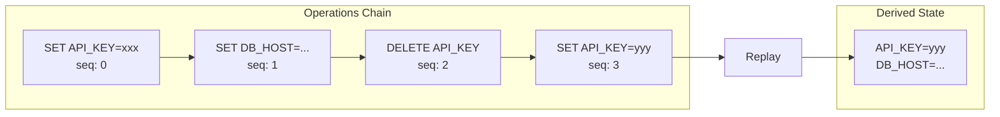
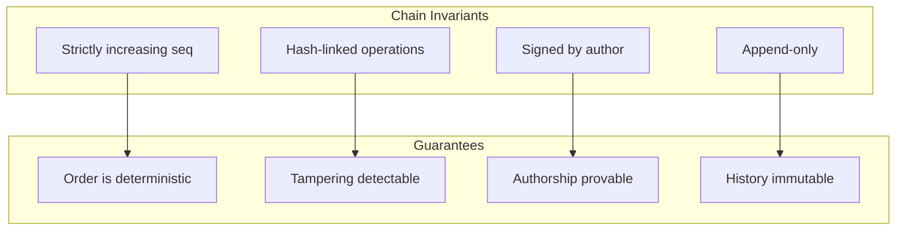
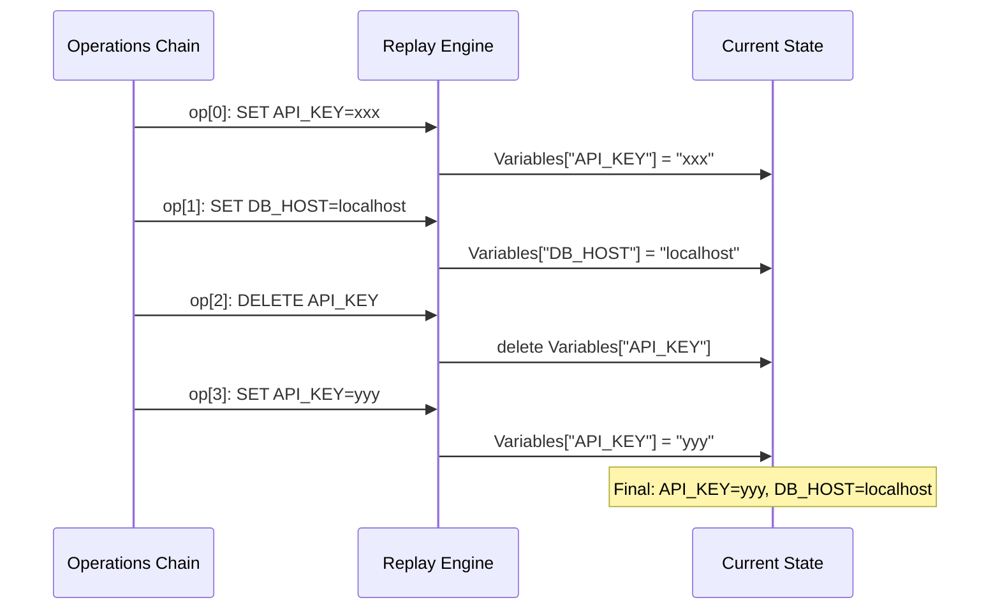
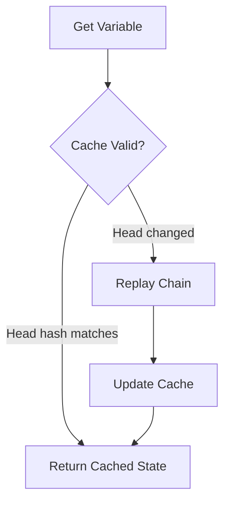
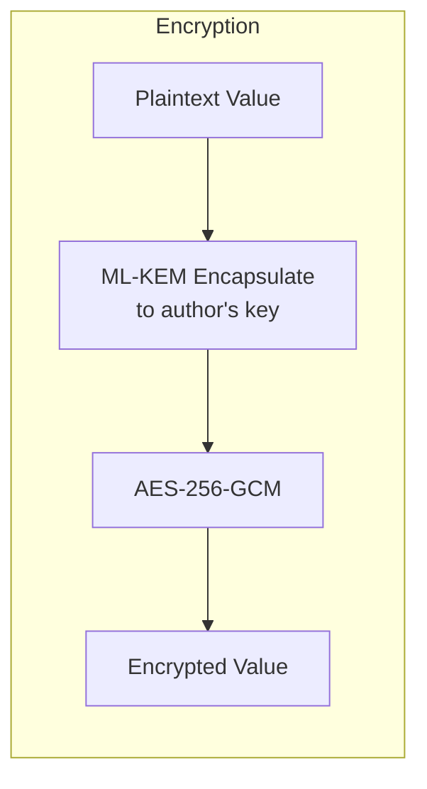
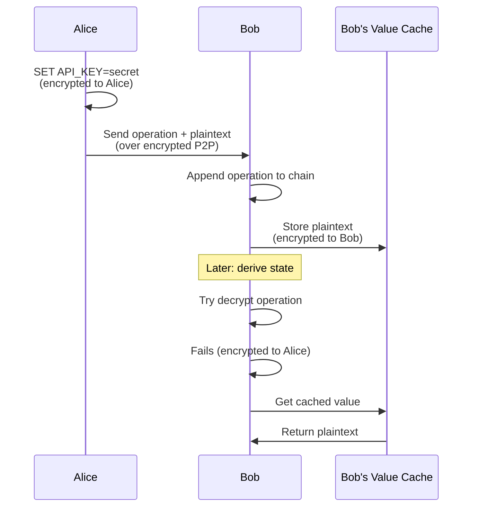
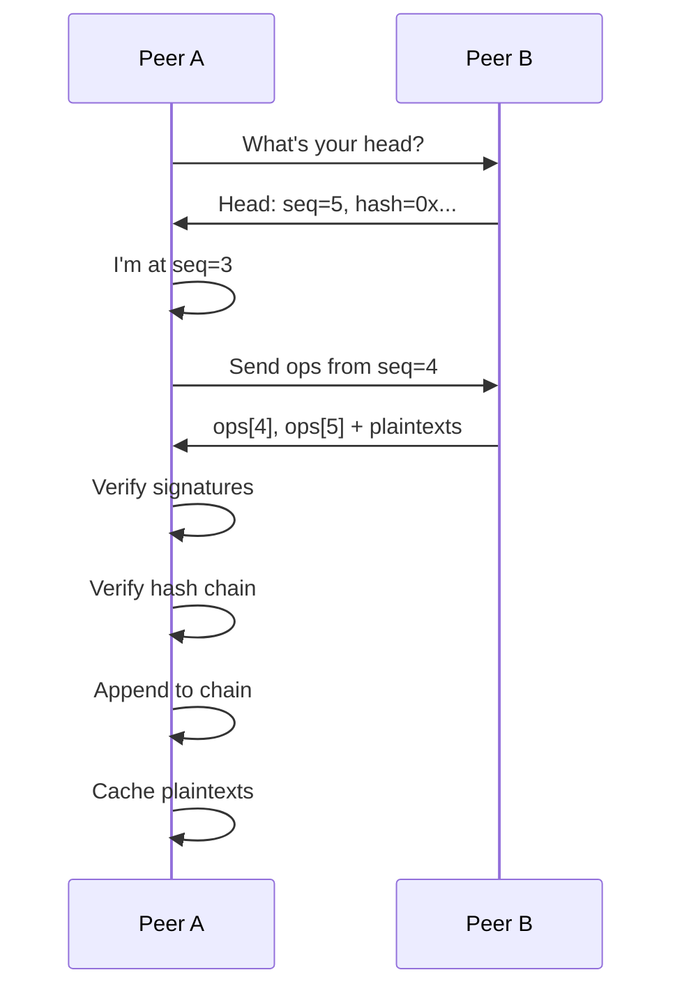
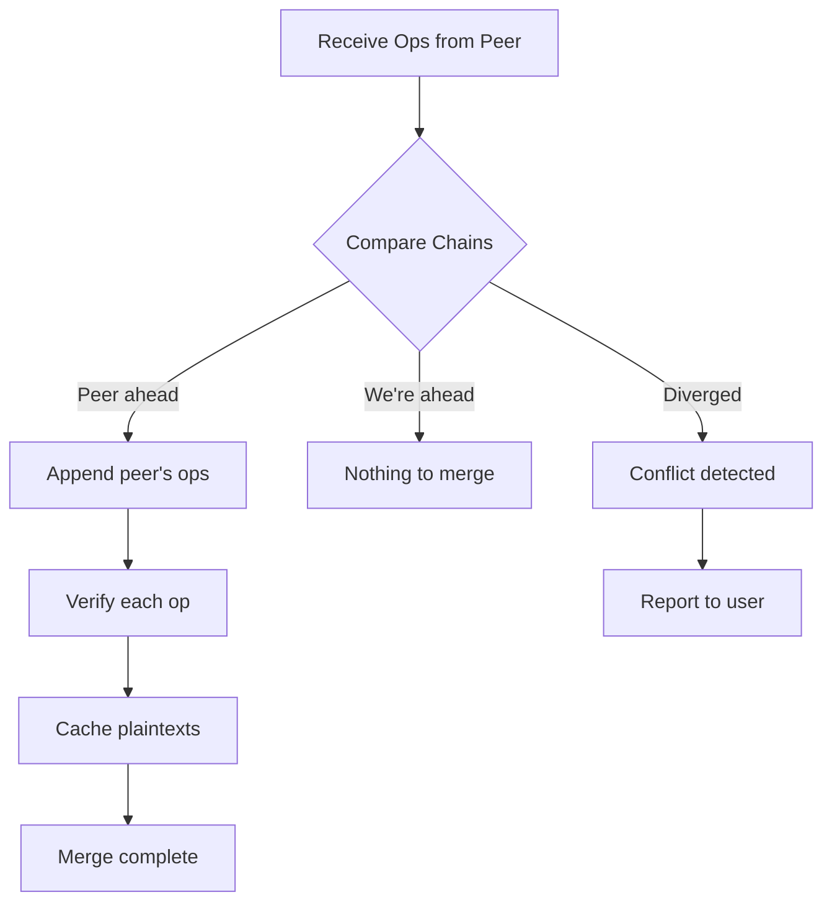
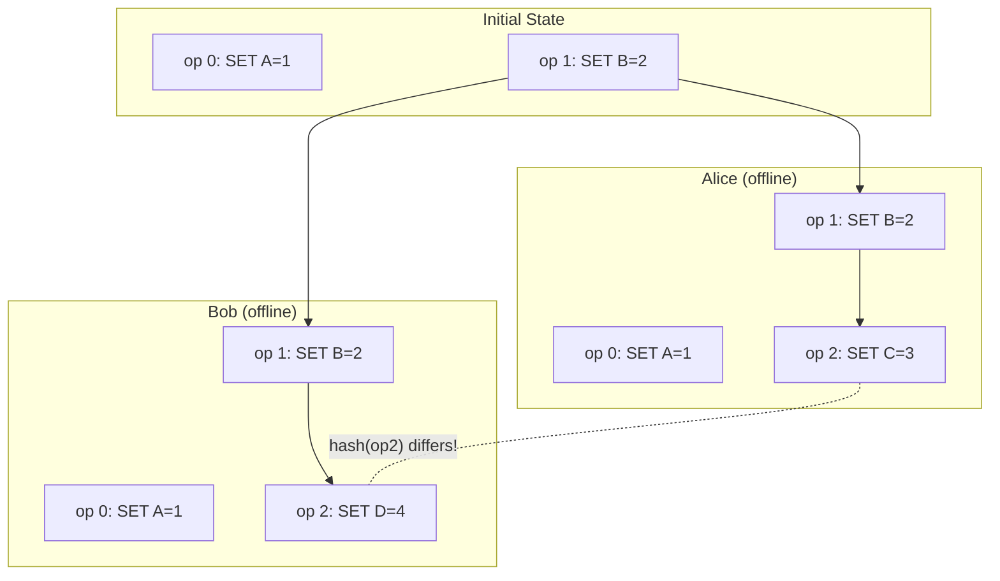

# envctl Storage Model

This document explains how envctl stores and synchronizes environment variables using an append-only operations chain model.

## Overview

envctl uses an **operations chain** rather than a simple key-value store. Instead of storing the current state of variables, it stores a sequence of operations (set, delete) that, when replayed, produce the current state.



## Why Operations Instead of Key-Value?

A naive approach would store environment variables as a simple key-value file:

```
API_KEY=secret123
DB_HOST=localhost
```

This fails for distributed teams because:

| Problem | Key-Value Store | Operations Chain |
|---------|-----------------|------------------|
| Who changed it? | Unknown | Signed by author |
| When was it changed? | Unknown | Timestamped |
| What was previous value? | Lost | Full history |
| Merge conflicts? | Overwrite | Detect and resolve |
| Prove tampering? | Cannot | Hash-linked chain |
| Offline sync? | Difficult | Append and merge |

### Design Goals

The operations model achieves:

1. **Complete Audit Trail** - Every change permanently recorded
2. **Cryptographic Proof** - Operations signed by author, hash-linked
3. **Offline Capability** - Append locally, sync when connected
4. **Conflict Detection** - Divergent chains immediately detectable
5. **Non-Repudiation** - Cannot deny creating an operation
6. **Deterministic State** - All peers derive identical state

## The Operations Chain

### Operation Structure

Each operation contains:

```go
type Operation struct {
    Seq            uint64    // Sequence number (0, 1, 2, ...)
    Timestamp      time.Time // When created (UTC)
    Author         []byte    // Signing public key
    Op             OpType    // "set" or "delete"
    Key            string    // Variable name (plaintext)
    EncryptedValue []byte    // Value encrypted to author
    PrevHash       []byte    // SHA-256 of previous operation
    Signature      []byte    // Ed25519 signature
}
```

### Chain Properties



**Sequence Numbers:**
- Operations are numbered 0, 1, 2, 3, ...
- No gaps allowed
- Enforced at append time

**Hash Linking:**
- Each operation includes previous operation's SHA-256 hash
- First operation has null prev_hash
- Prevents insertion or modification

**Signatures:**
- Each operation signed with author's Ed25519 key
- Binds author identity to operation
- Verified on receipt from peers

## State Derivation

State is **never stored permanently** - it's computed by replaying operations.

### Replay Algorithm



### Apply Rules

```go
func (s *State) Apply(op *Operation) {
    switch op.Op {
    case OpSet:
        plaintext := decrypt(op.EncryptedValue)
        s.Variables[op.Key] = plaintext
        s.Metadata[op.Key] = Metadata{
            UpdatedAt: op.Timestamp,
            UpdatedBy: fingerprint(op.Author),
            Seq:       op.Seq,
        }
    case OpDelete:
        delete(s.Variables, op.Key)
        delete(s.Metadata, op.Key)
    }
}
```

### State Caching

To avoid replaying the entire chain on every access:



Cache is invalidated when:
- New operations appended
- Chain merged with peer
- Head hash changes

## Encryption Model

### Value Encryption

Values are encrypted using ML-KEM-768 + AES-256-GCM:



**Important:** Operations are encrypted to the **author's own key**, not the team's keys.

### Why Self-Encryption?

Each operation is encrypted only to its author because:

1. **Key Management** - No need to re-encrypt when team changes
2. **Forward Secrecy** - Revoking a member doesn't require re-encrypting history
3. **Performance** - Single encryption per operation
4. **Simplicity** - No complex multi-recipient scheme

### Value Cache

Since operations are encrypted to authors, other team members need a way to read values:



The value cache:
- Stores plaintexts received from peers
- Encrypted to local identity for storage
- Indexed by operation hash
- Used during state replay for foreign operations

## File Storage

### Directory Structure

```
~/.envctl/
├── ops/                              # Operations chains
│   └── <project>/
│       ├── <env>.opschain.json       # The chain itself
│       ├── <env>.cache.json          # Cached state
│       └── <env>.values.json         # Value cache
│
├── chains/                           # Team membership chains
│   └── <team>/
│       └── chain.json
│
└── identity.enc                      # Encrypted identity
```

### Operations Chain Format

```json
{
  "version": 1,
  "project": "myproject",
  "environment": "production",
  "operations": [
    {
      "seq": 0,
      "timestamp": "2024-12-30T12:00:00Z",
      "author": "0x...",
      "op": "set",
      "key": "DATABASE_URL",
      "encrypted_value": "0x...",
      "prev_hash": null,
      "signature": "0x..."
    },
    {
      "seq": 1,
      "timestamp": "2024-12-30T12:01:00Z",
      "author": "0x...",
      "op": "set",
      "key": "API_KEY",
      "encrypted_value": "0x...",
      "prev_hash": "0x...",
      "signature": "0x..."
    }
  ]
}
```

### State Cache Format

```json
{
  "project": "myproject",
  "environment": "production",
  "head_seq": 1,
  "head_hash": "0x...",
  "variables": {
    "DATABASE_URL": "0x...",
    "API_KEY": "0x..."
  },
  "computed_at": "2024-12-30T12:01:00Z"
}
```

Variables in cache are encrypted to the local identity.

## Peer Synchronization

### Sync Protocol



### Export for Sync

When sending operations to a peer:

```go
type ExportedOp struct {
    Op             *Operation  // Original encrypted operation
    PlaintextValue string      // Decrypted value (for caching)
}
```

The plaintext is sent over the encrypted P2P channel, allowing the recipient to cache it.

### Merge Algorithm



**Merge Rules:**
1. If chains match up to our length, append their additional ops
2. If chains diverge (different hash at same seq), report conflict
3. Verify signature and hash chain for each incoming op
4. Cache plaintext values for ops encrypted to others

## Conflict Detection

### How Conflicts Arise



When Alice and Bob reconnect:
- Both have seq=2
- But different operations at seq=2
- Hash mismatch reveals conflict

### Conflict Resolution

Operations chains **detect** but don't auto-resolve conflicts:

```go
type Conflict struct {
    Seq     uint64     // Where divergence occurred
    OurOp   *Operation // Our operation at that seq
    TheirOp *Operation // Their operation at that seq
}
```

Resolution options:
1. **Accept theirs** - Rollback and apply their chain
2. **Keep ours** - They need to rollback
3. **Manual merge** - Create new operations to reconcile

## Team Chain vs Operations Chain

envctl uses two types of chains:

| Aspect | Team Chain | Operations Chain |
|--------|------------|------------------|
| **Purpose** | Membership & access | Environment variables |
| **Entries** | Blocks (multi-sig) | Operations (single-sig) |
| **Approvals** | Required for changes | Not required |
| **Conflict Resolution** | Automatic (deterministic) | Manual |
| **State** | Members, roles, policy | Key-value variables |

### Team Chain Conflict Resolution

Team chains auto-resolve using deterministic rules:

```go
func ResolveConflict(ourBlock, theirBlock *Block) *Block {
    // 1. Earlier timestamp wins
    if theirTime < ourTime {
        return theirBlock
    }

    // 2. Lower block hash wins (tie-breaker)
    if bytes.Compare(theirHash, ourHash) < 0 {
        return theirBlock
    }

    // 3. Lower signer fingerprint wins
    if theirSigner < ourSigner {
        return theirBlock
    }

    return ourBlock
}
```

Both peers always pick the same winner.

## Audit Trail

Every operation provides:

| Field | Audit Value |
|-------|-------------|
| `Timestamp` | When the change occurred |
| `Author` | Who made the change (public key) |
| `Signature` | Cryptographic proof of authorship |
| `PrevHash` | Chain integrity verification |
| `Key` | What variable was changed |
| `Op` | Whether set or deleted |

### Querying History

```bash
# View all operations for an environment
envctl env history --project myproject --env production

# Filter by author
envctl env history --author alice@example.com

# Filter by variable
envctl env history --key API_KEY
```

## Performance Considerations

### Chain Size

For typical usage:
- 100 operations ≈ 50 KB
- 1,000 operations ≈ 500 KB
- 10,000 operations ≈ 5 MB

### Replay Performance

State derivation is O(n) where n = number of operations.

Mitigations:
- **State caching** - Only replay when chain changes
- **Incremental replay** - Resume from cached checkpoint
- **Lazy loading** - Only decrypt values when accessed

### Sync Bandwidth

Only new operations are synced:
- Peer reports head seq
- Request ops from our seq + 1
- Receive only missing operations

## Design Principles

The storage model embodies these principles:

1. **Immutability** - Operations never modified or deleted
2. **Auditability** - Complete history of every change
3. **Verifiability** - Cryptographic proof of integrity
4. **Decentralization** - No server required
5. **Eventual Consistency** - Peers converge to same state
6. **Non-Repudiation** - Signatures prove authorship
7. **Confidentiality** - Values always encrypted
8. **Determinism** - Replay always produces same state

## Comparison to Alternatives

| Approach | Audit | P2P Sync | Conflict | Complexity |
|----------|-------|----------|----------|------------|
| Simple KV | None | Hard | Overwrite | Low |
| **Ops Chain** | Full | Natural | Detect | Medium |
| Git-like | Full | Complex | Branches | High |
| CRDT | Limited | Auto | Auto-merge | High |
| Blockchain | Full | Consensus | None | Very High |

The operations chain provides the best balance of auditability, sync capability, and implementation simplicity for team secrets management.
