# envctl Architecture Diagrams

These diagrams illustrate the P2P decentralized architecture of envctl.

## 1. High-Level P2P Network

This diagram shows how envctl creates a mesh network between team members, with an optional relay server for NAT traversal.

## 2. Data Flow: Setting & Syncing a Secret

This diagram shows what happens when a user sets an environment variable and how it syncs to peers.

## 3. Security Architecture Stack

This diagram shows the layered security model with post-quantum cryptography.

```mermaid
flowchart TB
    subgraph identity["🔐 Identity Layer"]
        direction LR
        ED["<b>Ed25519</b><br/>Signing Keys<br/>(Authentication)"]
        ML["<b>ML-KEM-768</b><br/>Encryption Keys<br/>(Post-Quantum Safe!)"]
        AR["<b>Argon2id</b><br/>128 MiB, 4 iterations<br/>(Key Protection)"]
    end

    subgraph transport["🔒 Transport Layer"]
        direction TB
        TLS["<b>Mutual TLS (mTLS)</b>"]
        TLS1["• Both peers verify Ed25519 certificates"]
        TLS2["• Fingerprint-based identity verification"]
        TLS3["• Optional SAS for MITM detection"]
        TLS --> TLS1
        TLS --> TLS2
        TLS --> TLS3
    end

    subgraph message["✉️ Message Layer"]
        direction TB
        MSG["<b>Message Security</b>"]
        MSG1["• Signed with Ed25519 (authenticity)"]
        MSG2["• Monotonic nonce (replay protection)"]
        MSG3["• Timestamp validation (freshness)"]
        MSG4["• Rate limiting (DoS protection)"]
        MSG --> MSG1
        MSG --> MSG2
        MSG --> MSG3
        MSG --> MSG4
    end

    subgraph data["💾 Data Layer"]
        direction LR
        TC["<b>Team Chain</b><br/>(Membership Blockchain)<br/>• Multi-sig approvals<br/>• Immutable audit trail<br/>• Consensus required"]
        OC["<b>Operations Chain</b><br/>(Env Vars Log)<br/>• Hash-linked operations<br/>• AES-256-GCM encrypted<br/>• Per-author encryption"]
    end

    identity --> transport
    transport --> message
    message --> data

    style identity fill:#e8f5e9,stroke:#2e7d32
    style transport fill:#e3f2fd,stroke:#1565c0
    style message fill:#fff3e0,stroke:#ef6c00
    style data fill:#fce4ec,stroke:#c2185b
```

## 4. Component Architecture

This diagram shows the internal structure of the envctl daemon.

```mermaid
flowchart TB
    subgraph external["External Interfaces"]
        CLI["CLI<br/>(envctl commands)"]
        PEERS["Remote Peers"]
        RELAY["Relay Server"]
    end

    subgraph daemon["ENVCTL DAEMON"]
        subgraph ipc["IPC Layer"]
            IPC["IPC Server<br/>(Unix Socket / TCP)"]
        end

        subgraph core["Daemon Core"]
            IM["Identity<br/>Manager"]
            CS["Chain Store<br/>(Team Chains)"]
            OCM["Ops Chain<br/>Manager<br/>(Env Variables)"]
        end

        subgraph peer["Peer Manager"]
            CP["Connection Pool"]
            CP1["• Per-peer state"]
            CP2["• Rate limiting"]
            CP3["• Keep-alive (30s)"]
        end

        subgraph discovery["Discovery & Transport"]
            MDNS["mDNS Discovery<br/>_envctl._tcp<br/>(LAN peers)"]
            RC["Relay Client<br/>WebSocket + auth<br/>(NAT traversal)"]
            TLS["TLS Listener<br/>port 7834"]
        end
    end

    CLI <--> IPC
    IPC <--> IM
    IPC <--> CS
    IPC <--> OCM

    IM --> CP
    CS --> CP
    OCM --> CP

    CP --> CP1
    CP --> CP2
    CP --> CP3

    CP <--> MDNS
    CP <--> RC
    CP <--> TLS

    MDNS <-.-> PEERS
    TLS <--> PEERS
    RC <-.-> RELAY

    style daemon fill:#f5f5f5,stroke:#424242
    style core fill:#e8f5e9,stroke:#388e3c
    style peer fill:#e3f2fd,stroke:#1976d2
    style discovery fill:#fff8e1,stroke:#ffa000
```

## 5. Traditional vs envctl Comparison

This diagram highlights the key differences between traditional secret management and envctl's P2P approach.

```mermaid
flowchart TB
    subgraph traditional["❌ TRADITIONAL SECRET MANAGEMENT"]
        direction TB
        CLOUD["☁️ CLOUD VENDOR<br/>(Vault, 1Password, AWS, etc.)"]
        INTERNET["🌐 Internet Required"]

        T_YOU["You"]
        T_TEAM["Teammate"]
        T_CI["CI/CD"]

        CLOUD --> INTERNET
        INTERNET --> T_YOU
        INTERNET --> T_TEAM
        INTERNET --> T_CI

        PROB1["⚠️ Single point of failure"]
        PROB2["💰 Monthly fees"]
        PROB3["🔓 Vendor sees secrets"]
        PROB4["🔌 Requires connectivity"]
    end

    subgraph envctl["✅ ENVCTL (P2P)"]
        direction TB
        E_YOU["You"]
        E_TEAM1["Teammate"]
        E_TEAM2["Teammate"]
        E_CI["CI/CD"]

        E_YOU <-->|"Direct P2P"| E_TEAM1
        E_TEAM1 <-->|"Direct P2P"| E_TEAM2
        E_TEAM2 <-->|"Direct P2P"| E_CI
        E_YOU <-->|"Direct P2P"| E_CI
        E_YOU <-->|"Direct P2P"| E_TEAM2
        E_TEAM1 <-->|"Direct P2P"| E_CI

        BEN1["✓ No vendor lock-in"]
        BEN2["✓ Free & open source"]
        BEN3["✓ End-to-end encrypted"]
        BEN4["✓ Works on LAN (mDNS)"]
    end

    style traditional fill:#ffebee,stroke:#c62828
    style envctl fill:#e8f5e9,stroke:#2e7d32
    style CLOUD fill:#ffcdd2,stroke:#b71c1c
```

## 6. Team Chain Consensus Flow

This diagram shows how team membership changes require multi-signature approval.

## 7. Operations Chain Structure

This diagram shows the append-only log structure of environment variables.

## 8. Connection Establishment Flow

This diagram shows how two peers discover each other and establish a secure connection.

```mermaid
sequenceDiagram
    autonumber
    participant A as Alice's Daemon
    participant MDNS as mDNS Network
    participant B as Bob's Daemon

    Note over A,B: Phase 1: Discovery

    A->>MDNS: Advertise _envctl._tcp<br/>(name, fingerprint, teams)
    B->>MDNS: Browse _envctl._tcp
    MDNS->>B: Service Found: Alice<br/>(addr, fingerprint, teams)

    Note over A,B: Phase 2: TLS Connection

    B->>A: TCP Connect (port 7834)

    rect rgb(227, 242, 253)
        Note over A,B: Mutual TLS Handshake
        A->>B: Server Certificate (Ed25519)
        B->>A: Client Certificate (Ed25519)
        A->>A: Verify Bob's fingerprint
        B->>B: Verify Alice's fingerprint
    end

    Note over A,B: Phase 3: Protocol Handshake

    rect rgb(232, 245, 233)
        B->>A: Handshake Message
        Note right of B: Version, Ed25519 Pub,<br/>ML-KEM Pub, Name, Teams
        A->>B: Handshake Response
        Note left of A: Version, Ed25519 Pub,<br/>ML-KEM Pub, Name, Teams
    end

    Note over A,B: Calculate shared teams

    A->>A: shared = intersection(A.teams, B.teams)
    B->>B: shared = intersection(A.teams, B.teams)

    Note over A,B: Phase 4: Chain Sync

    A->>B: MsgChainHead (for each shared team)
    B->>A: MsgChainHead (for each shared team)

    Note over A,B: ✅ Connection Established<br/>Keep-alive: ping/pong every 30s
```

